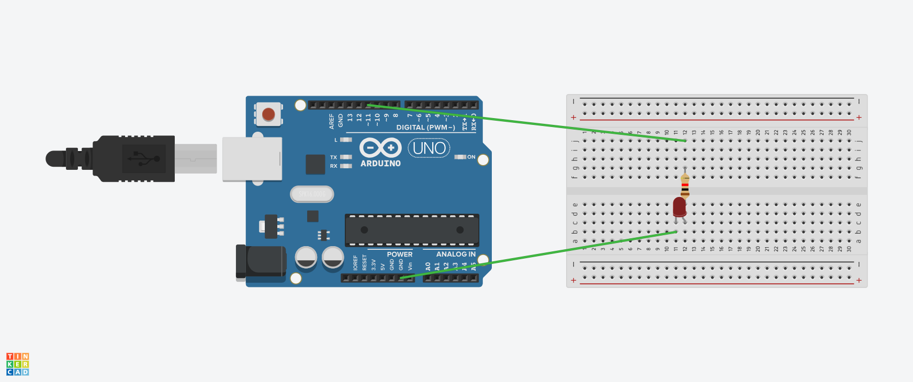

🌟 LED Fade (PWM) - Arduino Project

📌 Description
This project demonstrates how to use **PWM (Pulse Width Modulation)** on Arduino to make an LED gradually increase and decrease brightness.  
It’s one of the most common beginner projects to understand analog output.

---

🛠️ Components
- 1 × Arduino Uno  
- 1 × LED (any color)  
- 1 × 220Ω resistor  
- Breadboard  
- Jumper wires  

---

🚦 How it Works

1. The LED brightness increases gradually from 0 → 255 (fade in).

2. The LED stays fully bright for 1 second.

3. The LED brightness decreases gradually from 255 → 0 (fade out).

4. The LED stays off for 1 second.

5. The process repeats forever.

---

🎮 Simulation Link

👉 Open in Tinkercad
(https://www.tinkercad.com/things/hRXSdLHa5KL-lightfade?sharecode=-iMlCDMwuEGsG0-oPUC6FdX-ubHJ0LsskZQPsxlS1eY)

---

📚 Learning

1. Learned how to use PWM with analogWrite().

2. Understood the difference between digital output (HIGH/LOW) and analog output (0–255 PWM values).

3. Practiced using a for loop to create smooth effects.

---

🔌 Circuit


---

💻 Code
```cpp
int pin = 11;

void setup() {
  pinMode(pin, OUTPUT);
}

void loop() {
  // Fade in
  for (int i = 0; i <= 255; i++) {
    analogWrite(pin, i);
    delay(5);
  }
  delay(1000);

  // Fade out
  for (int i = 255; i >= 0; i--) {
    analogWrite(pin, i);
    delay(5);
  }
  delay(1000);
}
