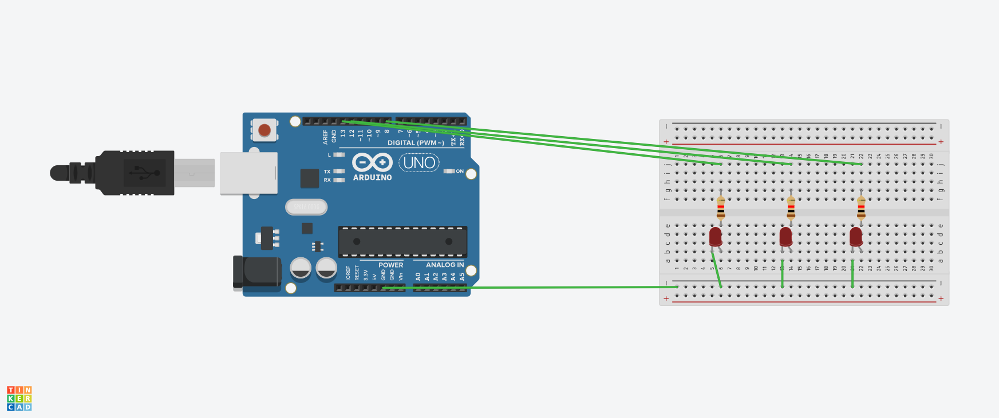

🚦 Arduino Traffic Light Simulation

📌 Description
This project simulates a simple traffic light system using an Arduino Uno and three LEDs.

---

🔧 Components
- Arduino Uno
- 1 × Green LED
- 1 × Yellow LED
- 1 × Red LED
- 3 × 220Ω resistors
- Breadboard + jumper wires

---

⚡ Circuit
Pin connections:
- Pin 13 → Green LED
- Pin 12 → Yellow LED
- Pin 8  → Red LED
- Common GND through resistors



---

🚦 How it Works

1. Green LED turns on for 3 seconds (cars go).

2. Green turns off → Yellow LED turns on for 1 second and blinks one time(warning).

3. Yellow turns off → Red LED turns on for 3 seconds (cars stop).

4. The cycle repeats forever, just like a real traffic light.

---

🎮 Simulation

👉 Open in Tinkercad
(https://www.tinkercad.com/things/kUTFqFEJNvD-trafficlightarduino?sharecode=Vcceaaffo3d8a-c7xfNsRC6vajsk5KNXCuxvyURRp0E)

---

📚 Learning

1. Learned how to control multiple digital outputs with digitalWrite().

2. Understood how to simulate real-world systems (traffic lights).

3. Practiced using delay() to control timing between LED states.

---

💻 Code
```cpp
void setup()
{
  pinMode(13, OUTPUT);
  pinMode(12, OUTPUT);
  pinMode(8, OUTPUT);


}

void loop()
{
  
  //Imagine as green
 digitalWrite(13,HIGH);
  delay(3000);
  digitalWrite(13,LOW);
   
  //Imagine as yellow
 digitalWrite(12,HIGH);
  delay(500);
  digitalWrite(12,LOW);
  delay(500);
  
  //Repeat the code to blink twice

   digitalWrite(12,HIGH);
  delay(500);
  digitalWrite(12,LOW);
   
  //Imagine as red
 digitalWrite(8,HIGH);
  delay(3000);
  digitalWrite(8,LOW);
   
  
}